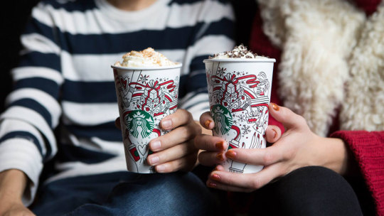

# Improving Starbuck’s Offers’ Success Rate: A Study to Analyze Purchasing Decisions

An analysis of data by Starbucks to deduce how users ’ hidden traits influence the success rate of different offers.

 
Image Source [Cloudinary](https://res.cloudinary.com/purnesh/image/upload/w_1000,f_auto/starbucks.jpg)

## Table of Contents

1. [Libraries and Installation](#libraries-and-installation)
2. [Project Overview](#project-overview)
3. [Problem Statement](#problem-statement)
4. [File Descriptions](#file-descriptions)
5. [Results](#results)
6. [Licensing and Acknowledgements](#licensing-and-acknowledgements)

## Libraries and Installation
Most of the code in this project will run with Python version 3.*. 
The following libraries are used in the notebook: `numpy`, `pandas`, `matplotlib`, `sklearn`, and `seaborn`.
To install any library exectue 'pip install library_name' in terminal.

## Project Overview
In collaboration with the Udacity Data Science Nanodegree program, Starbucks has provided data for the various offers rolled out to the users of the Starbucks rewards mobile app over time through various channels. The data contains information about offers, users, and the events such as offers received, viewed, or completed. 
Our job is to analyze these three data sets and figure out the patterns that would improve the offer success rates, i.e., figuring out which type of users would be better for which types of offers. In other words, customer segmentation- here, this means grouping customers according to the type of offers. 
I decided to take it a step further and tried to fit the data into a classification model that would predict if a particular type of offer with its given attributes would be successful for a given user.

## Problem Statement
There are following questions that I explore in the dataset:
1. What is the distribution of the offers that were rolled out? In this, we look at the data and try to figure out how the offers were distributed in terms of different offers and types of offers. 
2. How many offers were viewed and completed? In this, we try to figure out how many offers were successful, i.e., were both viewed and completed. 
3. What is the completion rate of each offer and each type of offer? Here, we would explore the completion rate of different types of offers to analyze which offers are more likely to be successful. 
4. What is the success rate of offers? The completion rate and success rate differ in that an offer is only considered to be successful if it was viewed and completed. The offers which were completed without being viewed were wasted since the customer anyways spent the money on the product. 
5. What does the demographic of the users look like? Here we will explore what type of users are present. 
6. What is the correlation between attributes of users and offers and offer success rate? Finally, we will look at how does user demographics influence the offer success rate along with the offer attributes that might affect the offer success rate.

## File Descriptions
The files used in this project have been grouped as follows:
1. `portfolio.json`: this file contains data for the offers that were rolled out.
2. `profile.json`: this file contains data of the users.
3. `transcript.json`: this file contains data for the various types of events that occurred.
4. `Starbucks-Project.ipynb`: this file contains the code for analysis and modeling of the dataset.
5. `Improving Starbuck’s Offers’ Success Rate: A Study to Analyze Purchasing Decisions | by Abhyuday Singh | Mar, 2021 | Medium.pdf`: this PDF file contains the blog explaining this project.

## Results
The results of this project can be found at the medium blog post [here](https://abhyuday-singh.medium.com/improving-starbucks-offers-success-rate-a-study-to-analyze-purchasing-decisions-6fa4b1651d97). 
To summarize, there are patterns among the type of users and the type of offers which influence the success of the different offers.

## Licensing and Acknowledgements
The code in this project is not licensed and can be used freely as required. Acknowledgements to Starbucks and Udacity for providing the dataset and to Udacity reviewers who provided feedback to make my project better.
